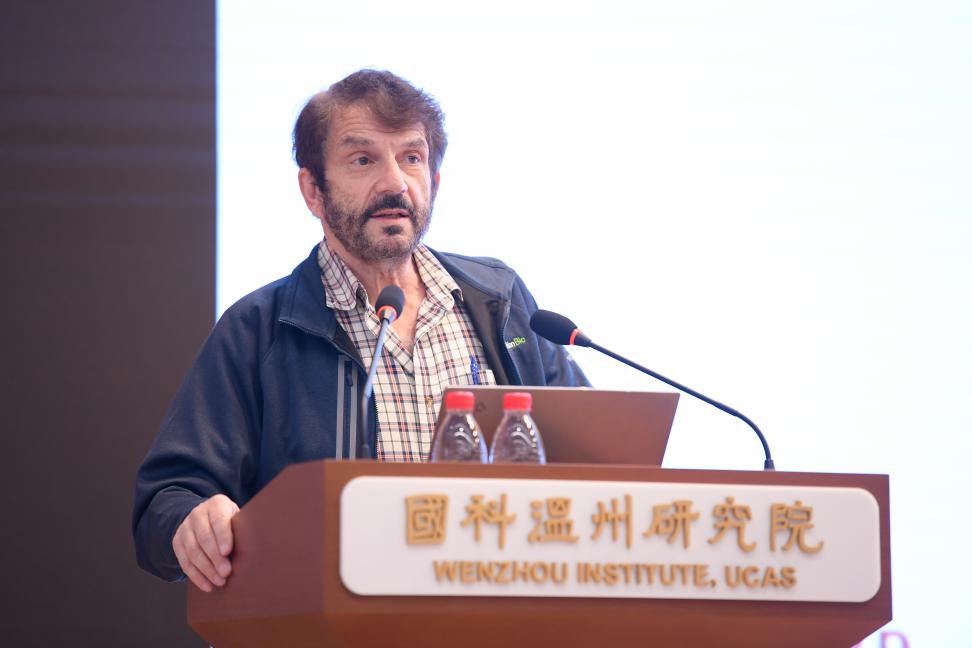
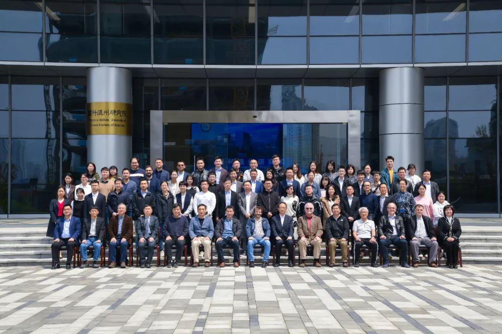

软物质是跨越物理、化学、生物、生命科学和工程等领域的重要前沿交叉学科，是推动现代科学技术创新发展的重要途径之一。
<!--more-->

4月8日，2023年国际软物质前沿研讨会在国科温州研究院成功举行。美国科学院院士、美国艺术与科学学院院士、美国工程院院士、中国工程院外籍院士、哈佛大学David A. Weitz教授，中国工程院院士陈建峰教授，欧洲科学院院士汪劲教授，香港浸会大学汤雷翰教授，复旦大学陈国颂教授等50余位国内外专家齐聚温州，共同探讨前沿软物质，促进学科交叉共融。国科温州研究院副院长叶方富致欢迎词。 
“我的实验室每天都会有很多人来交流，我很乐意和他们分享，包括我的想法，最新的研究情况，我不怕自己的idea被偷走......”分享、交流、合作是科学研究的重要精神态度，David A. Weitz 教授以他自身经历正式开启了本届研讨会的大幕。

探测软材料中的微小运动、蛋白质精确组装的新策略、病毒自组装中的基因组压缩、功能性材料健康解决方案......本届研讨会涉及高分子、生物大分子与材料、微流控、生物物理等软物质领域多个方向，专家们围绕主题一一做了精彩报告，分享最新成果进展，交流最新思想与感悟。现场，参会人员就相关主题展开探讨与交流，进一步拓展思维，进一步加强联动。

思想的火花在交流中无限碰撞 ，18个精彩报告，近100人参与的会议，开放、共享、拓新的理念在研讨会中蔓延生根，研讨会为从事软物质领域研究与开发的学者提供一个国内与国际间交流与合作的平台，同时也进一步促进了软物质领域发展，拓展了各原有学科领域的边界，协同创新的“朋友圈”也正加速扩大。
